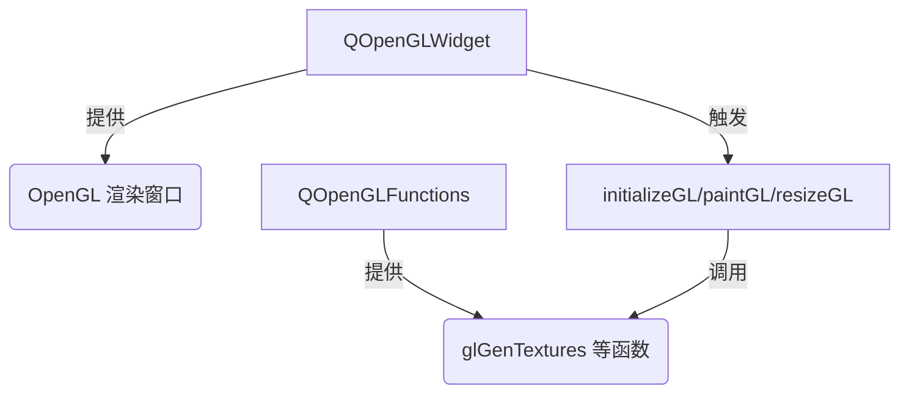

在 Qt 中，`QOpenGLWidget` 和 `QOpenGLFunctions` 是两个与 OpenGL 渲染相关的核心类，它们的分工如下：

---

### **1. `QOpenGLWidget`：提供渲染视窗**
#### **作用**
- **创建 OpenGL 渲染上下文**：  
  自动初始化 OpenGL 环境（包括上下文、帧缓冲区等），无需手动调用 `glXCreateContext` 或 `wglCreateContext`。
- **集成到 Qt 窗口系统**：  
  作为普通的 `QWidget` 子类，可直接嵌入 Qt 应用程序的 UI 布局中（如放在 `QMainWindow` 或 `QDialog` 中）。
- **管理渲染循环**：  
  通过重写 `paintGL()`、`initializeGL()`、`resizeGL()` 三个虚函数，提供结构化的 OpenGL 渲染流程。
- **处理平台差异**：  
  屏蔽不同操作系统（Windows/macOS/Linux）下 OpenGL 实现的差异，提供统一接口。

#### **关键功能**
```cpp
class XVideoWidget : public QOpenGLWidget {
protected:
    void initializeGL() override;   // 初始化 OpenGL 资源（着色器、纹理等）
    void paintGL() override;       // 执行实际渲染
    void resizeGL(int w, int h) override; // 响应窗口大小变化
};
```

#### **典型用途**
```cpp
// 在 Qt 窗口中嵌入 OpenGL 渲染视图
QMainWindow window;
XVideoWidget *glWidget = new XVideoWidget(&window);
window.setCentralWidget(glWidget); // 直接作为普通控件使用
```

---

### **2. `QOpenGLFunctions`：访问 OpenGL API**
#### **作用**
- **动态加载 OpenGL 函数**：  
  现代 OpenGL 的核心函数（如 `glGenBuffers`、`glCompileShader`）需要从驱动中动态获取，此类封装了这一过程。
- **跨版本兼容**：  
  根据运行时环境支持的最高 OpenGL 版本（如 3.3/4.5/ES 2.0），自动加载对应函数指针。
- **避免手动处理扩展**：  
  替代繁琐的 `glewInit()` 或 `gladLoadGL()`，简化 OpenGL 函数调用。

#### **关键功能**
```cpp
// 继承 QOpenGLFunctions 以直接调用 OpenGL 函数
class XVideoWidget : public QOpenGLWidget, protected QOpenGLFunctions {
    void initializeGL() override {
        initializeOpenGLFunctions(); // 必须调用！加载函数指针
        glClearColor(0, 0, 0, 1);   // 现在可以安全调用 OpenGL API
    }
};
```

#### **与原生 OpenGL 的区别**
| **操作**               | **原生 OpenGL**               | **QOpenGLFunctions**                     |
|------------------------|-------------------------------|------------------------------------------|
| 初始化函数指针         | 需手动调用 `glewInit()`       | 调用 `initializeOpenGLFunctions()`      |
| 调用函数               | 直接调用 `glGenBuffers()`      | 相同（但必须继承或持有 QOpenGLFunctions）|
| 平台兼容性             | 需自行处理                    | 自动适配                                 |

---

### **3. 二者协作关系**


1. **`QOpenGLWidget`** 负责创建和管理可视化的渲染区域。
2. **`QOpenGLFunctions`** 提供具体的 OpenGL 指令实现。
3. **协作流程**：  
   - 用户通过继承 `QOpenGLWidget` 创建自定义 OpenGL 控件。  
   - 在 `initializeGL()` 中调用 `initializeOpenGLFunctions()` 加载函数指针。  
   - 在 `paintGL()` 中使用 OpenGL 函数（如 `glDrawArrays`）渲染内容。

---

### **4. 为什么需要这两个类？**
- **简化 OpenGL 窗口管理**：  
  直接使用原生 OpenGL 需要处理大量平台相关代码（如 `WGL`、`GLX`），而 `QOpenGLWidget` 封装了这些细节。
- **安全访问 API**：  
  `QOpenGLFunctions` 确保函数指针正确加载，避免运行时崩溃（尤其在旧驱动或移动设备上）。
- **与 Qt 生态无缝集成**：  
  支持信号/槽、事件处理、样式表等 Qt 特性，与其他控件（如 `QPushButton`）混合布局。

---

### **5. 常见问题**
#### **Q1: 不继承 `QOpenGLFunctions` 会怎样？**
- 调用 OpenGL 函数（如 `glClear`）可能导致 **段错误**，因为函数指针未加载。

#### **Q2: 能否用 GLEW/GLAD 替代 `QOpenGLFunctions`？**
- 可以，但需确保在 `QOpenGLWidget` 的上下文生效后初始化：
  ```cpp
  void XVideoWidget::initializeGL() {
      glewExperimental = GL_TRUE;
      glewInit(); // 替代 initializeOpenGLFunctions()
  }
  ```
